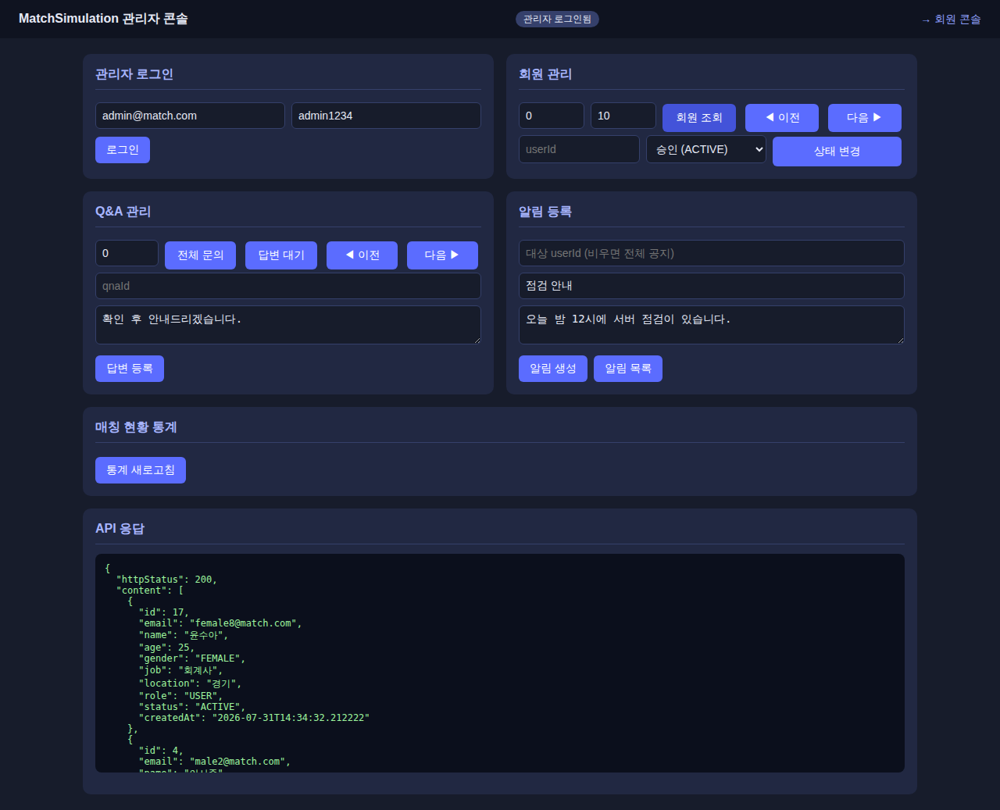
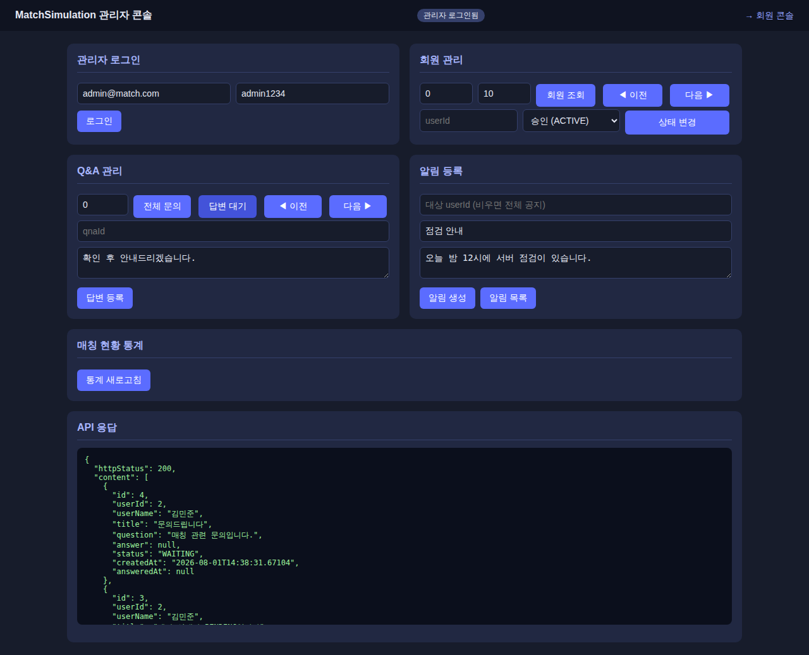
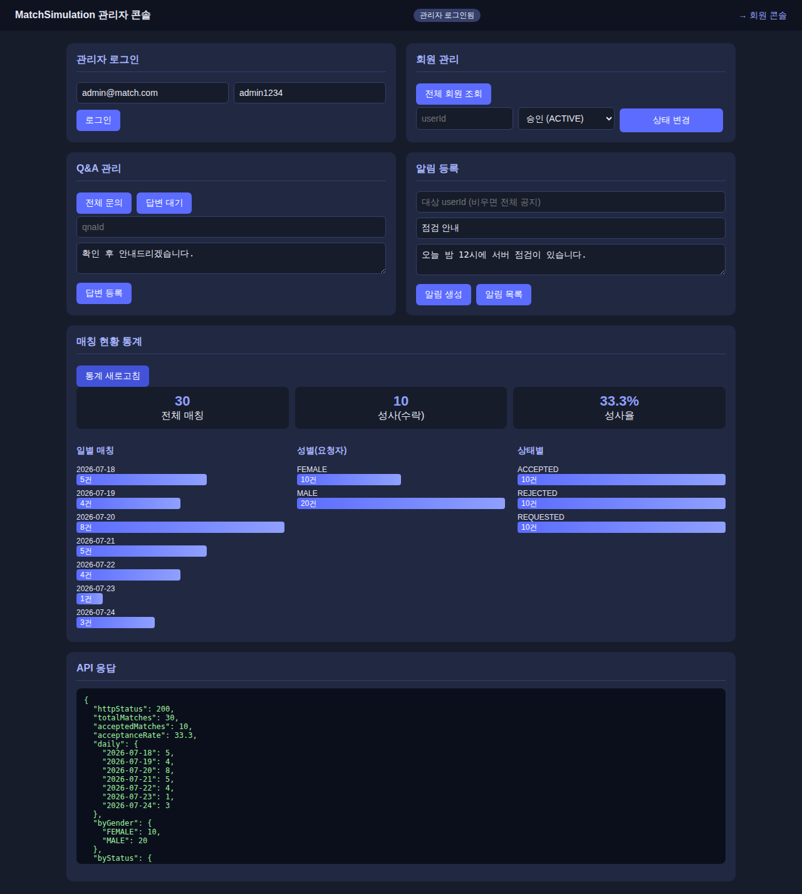
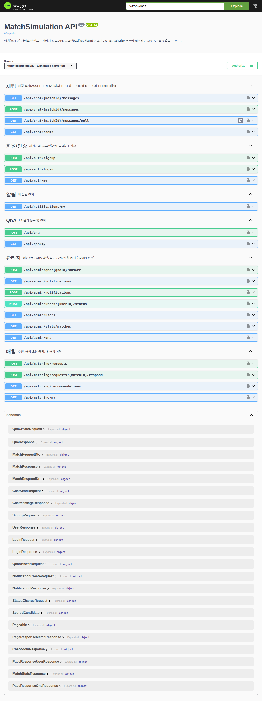

# 관리자 모드 문서 (Admin Mode)

대상: AdminHub의 전체 기능 — 회원관리, QnA 답변, 알림 발송, 매칭 현황 통계
콘솔: `http://localhost:8080/admin.html`

기본 관리자 계정: `admin@match.com` / `admin1234`
인증: 로그인으로 발급받은 **JWT**를 `X-AUTH-TOKEN` 헤더에 전달.
모든 관리자 API는 Spring Security 규칙(`/api/admin/** → hasRole('ADMIN')`)으로
보호되며, ADMIN이 아니면 **403** `{"status":403,"message":"관리자 권한이 필요합니다."}`.

---

## 1. 기능 명세

| 기능 | 내용 |
| :--- | :--- |
| 회원 관리 | 전체 회원 목록 조회, 상태 변경 — `PENDING`(가입 대기) / `ACTIVE`(승인) / `SUSPENDED`(정지) |
| Q&A 관리 | 전체/상태별 문의 목록 조회, 답변 작성(→ `ANSWERED`, 답변 시각 기록) |
| 알림 발송 | 전체 공지(대상 미지정) 또는 개별 회원 대상 알림 생성, 발송 이력 조회 |
| 매칭 통계 | 전체/성사 건수, 성사율(%), 일별·성별(요청자 기준)·상태별 매칭 건수 요약 |
| 자동 만료 배치 | 7일 무응답 `REQUESTED` 매칭을 `EXPIRED`로 전이하고 요청자에게 알림 |

## 2. API 명세

Base URL: `http://localhost:8080` · 모든 관리자 API는 관리자 토큰 `X-AUTH-TOKEN` 필요
에러 응답(공통): `{"status": 400|401|403|404, "message": "..."}`

### POST /api/auth/login — 로그인 (JWT 발급)
```json
// Request
{"email":"admin@match.com","password":"admin1234"}
// Response 200
{"token":"eyJhbGciOiJIUzI1NiJ9...","user":{ ...UserResponse }}
```

### GET /api/admin/users — 전체 회원 목록 (페이징)
- 파라미터: `?page=0&size=10&sort=createdAt,desc` (size 최대 100)
```json
// Response 200
{"content":[{ ...UserResponse }],
 "page":0,"size":10,"totalElements":21,"totalPages":3,"hasNext":true}
```
- 400: 존재하지 않는 sort 필드 (`{"status":400,"message":"정렬할 수 없는 필드입니다: ..."}`)

### PATCH /api/admin/users/{userId}/status — 회원 상태 변경 (승인/정지)
```json
// Request
{"status":"ACTIVE"}   // PENDING | ACTIVE | SUSPENDED
// Response 200 — 변경된 UserResponse
```
- 부수효과: ACTIVE 변경 시 "회원 승인 완료", SUSPENDED 변경 시 "계정 정지 안내" 알림이
  같은 트랜잭션으로 생성된다 (알림 실패 시 상태 변경도 롤백)
- 동일 상태로 변경하면 알림은 생성되지 않는다
- `SUSPENDED` 전환 시 해당 회원이 이미 발급받은 JWT도 즉시 무효화된다 (401)

### GET /api/admin/qna?status=WAITING — 문의 목록 (페이징)
- `status` 생략 시 전체, `WAITING`/`ANSWERED` 필터 가능
- 페이징 파라미터 동일 (`page`/`size`/`sort`), 응답은 `PageResponse<QnaResponse>` 포맷

### POST /api/admin/qna/{qnaId}/answer — 답변 작성
```json
// Request
{"answer":"확인했습니다"}
// Response 200 — status=ANSWERED, answeredAt 채워진 QnaResponse
```

### POST /api/admin/notifications — 알림 발송
```json
// Request (targetUserId=null 이면 전체 공지)
{"targetUserId":null,"title":"점검 안내","message":"오늘 밤 12시 점검"}
// Response 201 — NotificationResponse
```

### GET /api/admin/notifications — 발송 이력 조회

### GET /api/admin/stats/matches — 매칭 현황 통계
```json
// Response 200
{"totalMatches":31,"acceptedMatches":11,"acceptanceRate":35.5,
 "daily":{"2026-07-17":1,"2026-07-24":4},
 "byGender":{"FEMALE":10,"MALE":21},
 "byStatus":{"ACCEPTED":11,"EXPIRED":1,"REJECTED":10,"REQUESTED":9}}
```

## 3. 매칭 통계 집계 동작

집계는 **DB의 GROUP BY**가 수행하고, 애플리케이션은 결과 행을 Map으로 옮기기만 한다.

| 항목 | 쿼리 | 사용 인덱스 |
| :--- | :--- | :--- |
| `byStatus` | `group by status` | `idx_match_records_status` |
| `byGender` | `left join users on users.id = requester_id` → `group by gender` | `idx_match_records_requester_id` |
| `daily` | `group by cast(created_at as date)` | `idx_match_records_created_at` |

- `totalMatches` / `acceptedMatches` / `acceptanceRate`는 `byStatus` 결과에서 파생되므로
  **추가 쿼리가 없다** (통계 1회 = 3쿼리).
- 요청자가 삭제된 매칭도 누락되지 않도록 성별 집계는 LEFT JOIN + `UNKNOWN` 처리.
- 60초 TTL 캐시(`matchStats`)가 적용되고, 매칭 상태를 바꾸는 유일한 경로인
  **만료 배치 실행 시 즉시 무효화**된다.
- `byStatus`에는 7일 무응답 자동 만료로 생긴 `EXPIRED`가 포함된다.

## 4. 콘솔 사용 시나리오 (`/admin.html`)

1. `admin@match.com` / `admin1234`로 **로그인**
2. **전체 회원 조회** → PENDING 회원의 userId로 **상태 변경(승인)**
3. **답변 대기** 조회 → qnaId 입력 후 **답변 등록**
4. **알림 생성** — 대상 userId를 비우면 전체 공지, 지정하면 개별 알림
5. **통계 새로고침** → 전체/성사/성사율 카드와 일별·성별·상태별 막대그래프 확인

## 5. 동작 화면

| 화면 | 설명 |
| :--- | :--- |
|  | 전체 회원 조회 / 상태 변경 |
|  | 답변 대기 조회 / 답변 등록 |
|  | 매칭 현황 통계 — 성사율 카드 + 일별/성별/상태별 그래프 |
|  | API 문서에서 Authorize 후 실호출 |
