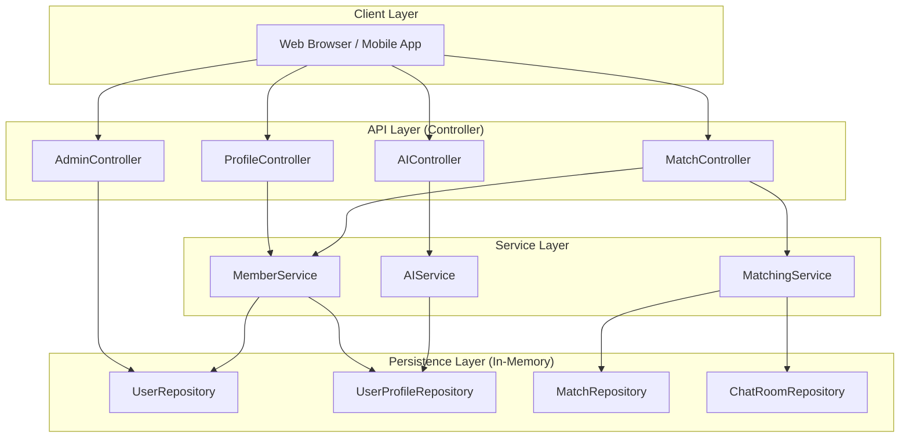
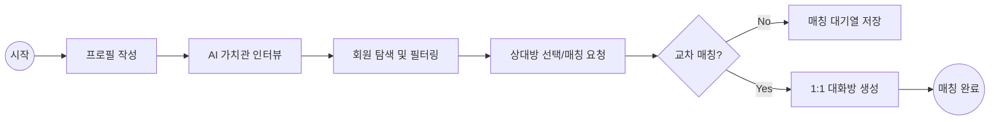
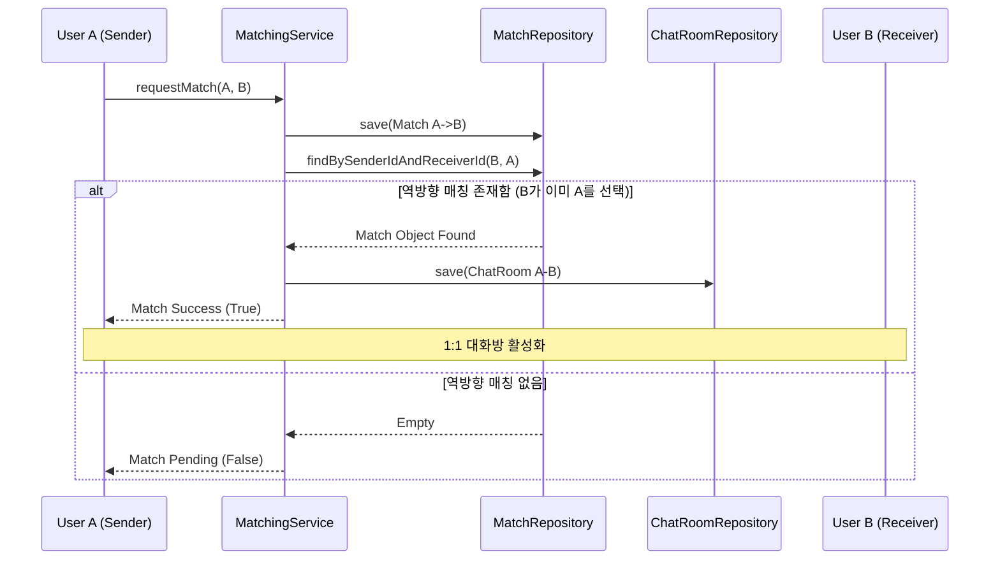
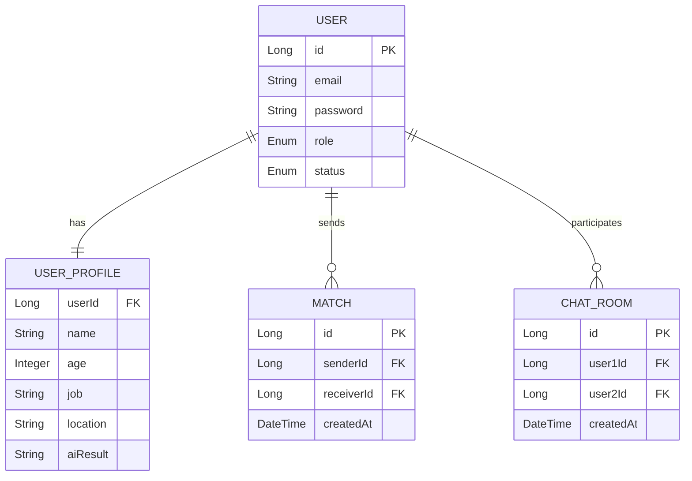

# MatchSimulation Architecture & Flow Document

본 문서는 MatchSimulation 프로젝트의 기술 아키텍처와 서비스 흐름을 시각화하여 기술합니다.

## 1. 시스템 아키텍처 (System Architecture)

프로젝트는 표준 Layered Architecture를 따르며, Phase 1에서는 인메모리 저장소를 사용합니다.

---

## 2. 서비스 핵심 플로우 (Service Flow)

사용자가 가입 후 실제 매칭에 이르기까지의 주요 여정입니다.

---

## 3. 교차 매칭 시퀀스 (Matching Logic Sequence)

상호 선택 시 대화방이 생성되는 백엔드 로직의 상세 흐름입니다.

---

## 4. 도메인 데이터 구조 (Logical ERD)

---

## 5. 향후 확장 계획

| 단계 | 내용 | 시각화 목표 |
| :--- | :--- | :--- |
| **Phase 2** | DB 연동 | 외부 RDBMS(MySQL) 아이콘 및 연결선 추가 |
| **Phase 3** | AI 고도화 | Gemini API External Cloud 연동 구조 |
| **Phase 4** | 실시간성 | WebSocket / Redis Pub-Sub 레이어 추가 |
