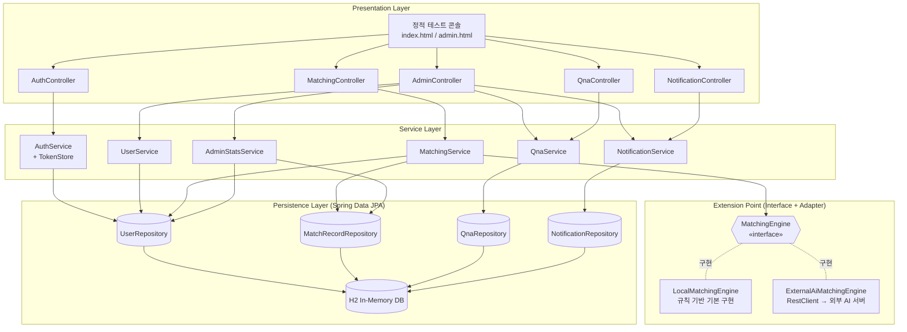
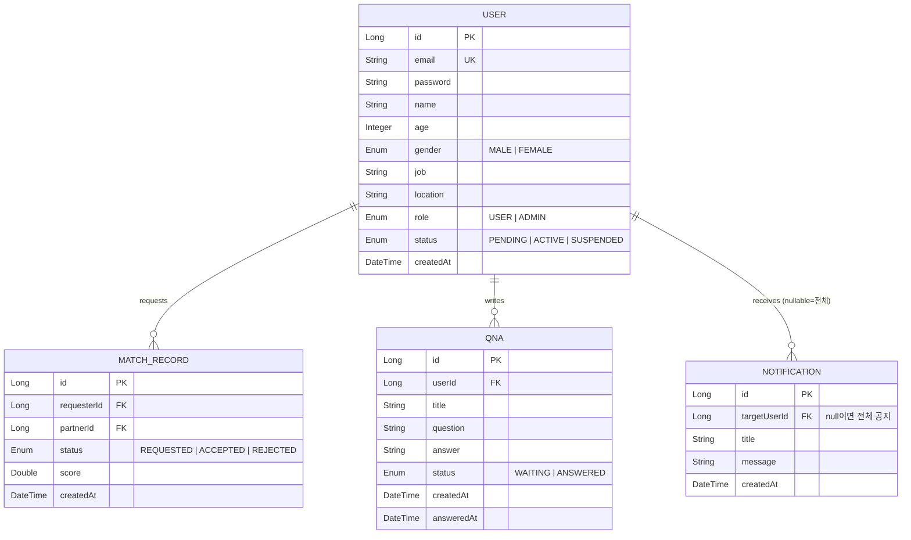
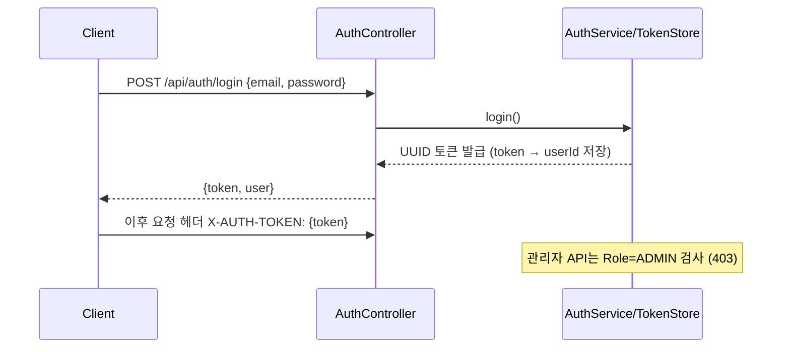

# MatchSimulation 아키텍처 설계서 (Phase 2)

작성일: 2026-07-24
대상 버전: Java 21 / Spring Boot 4.1.x / H2 In-Memory DB

본 문서는 매칭 애플리케이션 백엔드 + 관리자(Admin) 모드의 아키텍처 설계서입니다.
구현 전(Phase 1 문서화) 단계에서 작성되었으며, 구현 완료 후 기능/API 명세는
`docs/functional_spec.md`, `docs/api_spec.md`를 참조하십시오.

---

## 1. 기술 스택

| 구분 | 선택 | 비고 |
| :--- | :--- | :--- |
| Language | Java 21 (LTS) | Record 기반 DTO, Virtual Threads 활성화 |
| Framework | Spring Boot 4.1.0 (Spring Framework 7) | `spring-boot-starter-webmvc` (Boot 4 신규 스타터 명칭) |
| Persistence | Spring Data JPA + **H2 In-Memory DB** | `ddl-auto: create-drop`, 기동 시 시드 데이터 자동 적재 |
| HTTP Client | `spring-boot-starter-restclient` | 외부 AI 매칭 서버 연동용 (Adapter에서 사용) |
| Build | Gradle 9 (Wrapper) | BOM은 Gradle native platform 방식 |
| 인증 | In-Memory 더미 토큰 (UUID) | Spring Security 미사용, `X-AUTH-TOKEN` 헤더 |

## 2. 계층형 아키텍처 (Layered Architecture)



## 3. 패키지 구조 — 기능별 모듈(package-by-feature)

기능 단위로 모듈을 분리했다. 각 모듈은 내부에 `controller / service / repository /
domain / dto` 를 가지며, 모듈 간 참조를 최소화해 추후 Gradle 멀티모듈이나
마이크로서비스로 분리하기 쉽게 했다.

```
com.pebble.mvp
├── MatchSimulationApplication.java
├── common/                          # 공통 인프라 모듈
│   ├── ApiException.java            # 상태코드 포함 비즈니스 예외
│   └── GlobalExceptionHandler.java  # @RestControllerAdvice → JSON 에러 응답
├── config/
│   └── DataInitializer.java         # H2 시드 데이터 적재 (CommandLineRunner)
├── user/                            # 회원 모듈 (인증·계정)
│   ├── controller/AuthController    # 회원가입 / 로그인 / 내 정보
│   ├── service/  AuthService, TokenStore, UserService
│   ├── domain/   User, Role, UserStatus, Gender
│   ├── repository/UserRepository
│   └── dto/      AuthDtos (record)
├── matching/                        # 매칭 모듈
│   ├── controller/MatchingController # 추천 / 매칭 요청 / 응답 / 내 매칭
│   ├── service/  MatchingService
│   ├── engine/                      # ★ AI 연동 확장 접점
│   │   ├── MatchingEngine.java             # 인터페이스
│   │   ├── ScoredCandidate.java            # 추천 결과 record
│   │   ├── LocalMatchingEngine.java        # 기본(규칙 기반) 어댑터
│   │   └── ExternalAiMatchingEngine.java   # 외부 AI 서버 어댑터
│   ├── domain/   MatchRecord, MatchStatus
│   ├── repository/MatchRecordRepository
│   └── dto/      MatchingDtos
├── qna/                             # QnA 모듈
│   ├── controller/QnaController     # 문의 등록 / 내 문의
│   ├── service/  QnaService
│   ├── domain/   Qna, QnaStatus
│   ├── repository/QnaRepository
│   └── dto/      QnaDtos
├── notification/                    # 알림 모듈
│   ├── controller/NotificationController # 내 알림
│   ├── service/  NotificationService
│   ├── domain/   Notification
│   ├── repository/NotificationRepository
│   └── dto/      NotificationDtos
└── admin/                           # 관리자 모듈
    ├── controller/AdminController   # 회원관리 / QnA관리 / 알림등록 / 통계
    ├── service/  AdminStatsService  # 일별/성별/상태별 매칭 통계
    └── dto/      AdminDtos
```

> 확장 접점(`matching.engine`)은 인터페이스/어댑터로 분리되어 있어
> 외부 AI 서버 연동 시 어댑터 교체가 한 곳에서 일어난다.

## 4. 주요 컴포넌트 역할

| 컴포넌트 | 역할 |
| :--- | :--- |
| `AuthService` / `TokenStore` | 회원가입·로그인. 로그인 성공 시 UUID 토큰 발급, `X-AUTH-TOKEN` 헤더로 인증. 관리자 API는 `requireAdmin()`으로 Role 검사 |
| `MatchingService` | 추천 후보 조회(ACTIVE + 이성) 후 `MatchingEngine`에 위임, 매칭 요청/수락/거절 상태 전이 관리 |
| `MatchingEngine` | **AI/외부 서버 연동 접점.** 후보 목록을 받아 점수화된 추천 목록을 반환하는 순수 인터페이스 |
| `LocalMatchingEngine` | 기본 구현. 지역 일치·나이 차이·직군 가중치 규칙 기반 점수 산출 |
| `ExternalAiMatchingEngine` | `RestClient`로 외부 AI 서버(`matching.ai.base-url`) 호출. `matching.engine=external-ai` 설정 시 활성화 |
| `AdminStatsService` | 매칭 레코드를 일별/성별/상태별로 집계하여 요약 DTO 반환 |
| `DataInitializer` | 기동 시 관리자 1명 + 일반회원 20명 + 매칭/문의/알림 샘플 데이터를 H2에 적재 |

## 5. 외부 AI / 외부 서버 연동 접점 정의

교체는 **코드 수정 없이 설정만으로** 이루어진다.

```yaml
# application.yml
matching:
  engine: local          # local | external-ai
  ai:
    base-url: http://localhost:9090   # 외부 AI 매칭 서버 주소
```

```java
public interface MatchingEngine {
    List<ScoredCandidate> recommend(User me, List<User> candidates);
}
```

- `local`(기본): `LocalMatchingEngine` 빈 등록 (`@ConditionalOnProperty`, matchIfMissing)
- `external-ai`: `ExternalAiMatchingEngine` 빈 등록. 계약(요청/응답 JSON)은 API 명세서에 정의
- 외부 DB 전환: H2 → MySQL 등은 JPA 사용으로 `application.yml`의 datasource 교체만으로 가능

## 6. 도메인 모델 (ERD)



## 7. 인증 흐름 (In-Memory 더미 인증)



## 8. 향후 확장 계획

| 단계 | 내용 |
| :--- | :--- |
| AI 연동 | `matching.engine=external-ai` 전환 후 외부 AI 서버 계약만 맞추면 즉시 연동 |
| DB 전환 | H2 → MySQL/PostgreSQL: datasource 설정 교체 (JPA 코드 무변경) |
| 인증 고도화 | TokenStore → JWT/Spring Security 교체 (Controller 시그니처 유지) |
| 실시간성 | 매칭 성사 알림 WebSocket 확장 |
