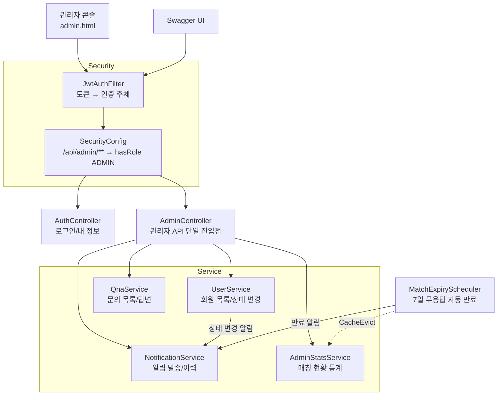
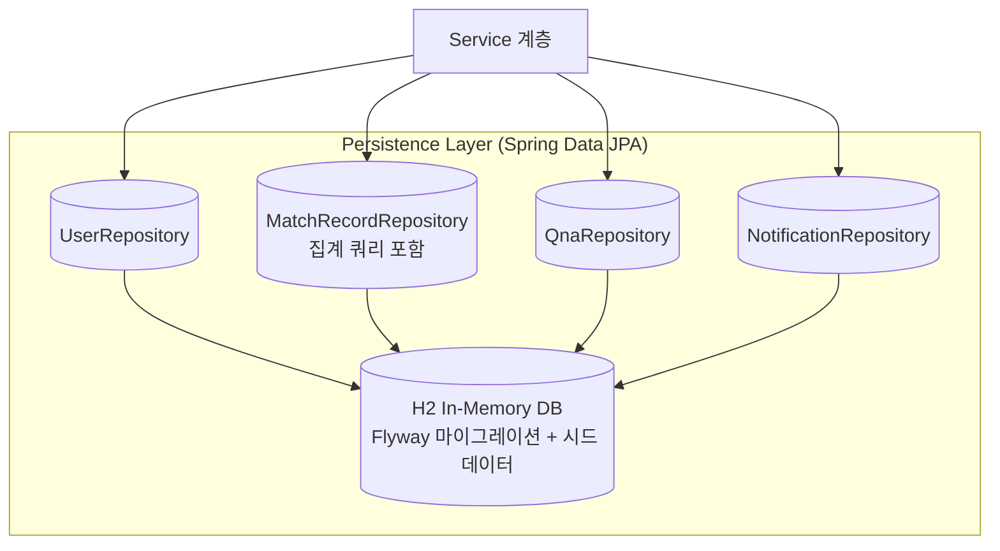
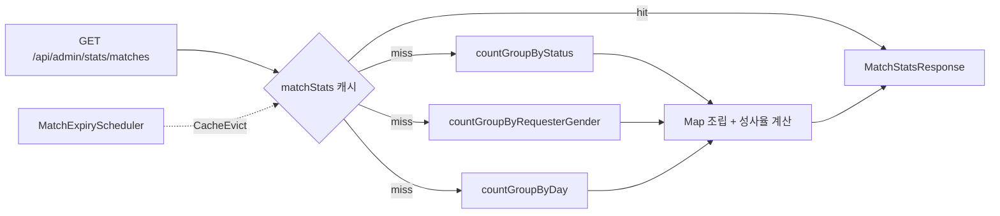
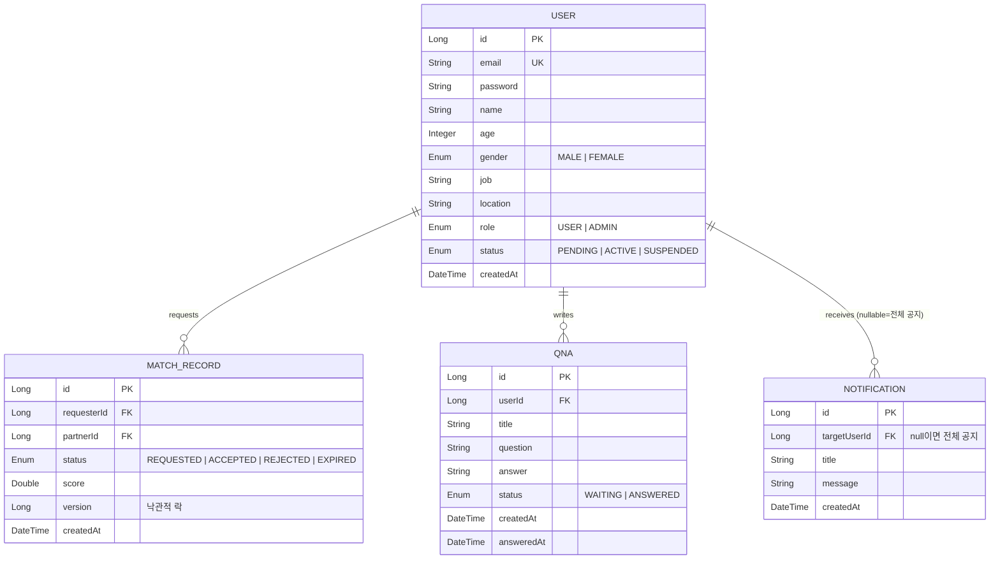
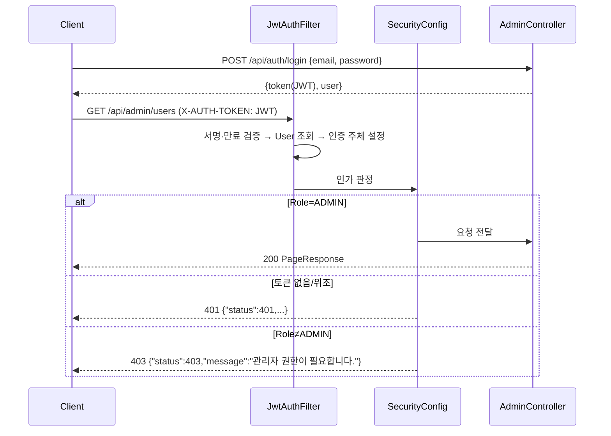

# AdminHub 아키텍처 설계서

대상 버전: Java 21 / Spring Boot 4.1.x / H2 In-Memory DB

본 문서는 운영 관리자 콘솔 백엔드 **AdminHub**의 아키텍처 설계서입니다.
기능/API 명세는 `docs/admin_mode.md`를 참조하십시오.

> **전환 배경** — 이 코드베이스는 매칭 서비스(MatchSimulation)의 사용자 모드와
> 관리자 모드를 함께 갖고 있었습니다. 관리자 모드만 남기기로 하면서
> 채팅·매칭 추천/요청·사용자 문의 등록·사용자 알림 조회 경로를 제거하고,
> 관리자 API가 소비하던 도메인(회원·문의·알림·매칭 기록)만 남겼습니다.

---

## 1. 기술 스택

| 구분 | 선택 | 비고 |
| :--- | :--- | :--- |
| Language | Java 21 (LTS) | Record 기반 DTO, Virtual Threads 활성화 |
| Framework | Spring Boot 4.1.0 (Spring Framework 7) | `spring-boot-starter-webmvc` |
| Persistence | Spring Data JPA + H2 In-Memory DB | 스키마 소유는 **Flyway**, Hibernate는 `ddl-auto=validate` |
| 인증 | Spring Security + JWT(HS256) + BCrypt | `X-AUTH-TOKEN` 헤더, 세션 STATELESS |
| 캐시 | Caffeine (`matchStats`, TTL 60초) | 매칭 상태 변경 시 `@CacheEvict` |
| 문서 | springdoc-openapi | `/swagger-ui.html` |

## 2. 시스템 구성

관리자 콘솔(`/admin.html`)과 Swagger UI가 클라이언트이고,
`AdminController`가 관리자 기능의 단일 진입점입니다.
인가는 컨트롤러가 아니라 `SecurityConfig`의 경로 규칙이 담당합니다.



### 2.1 영속 계층



## 3. 패키지 구조 — 기능별 모듈(package-by-feature)

```
com.pebble.adminhub
├── AdminHubApplication.java
├── common/                           # 공통 인프라 모듈
│   ├── ApiException.java             # 상태코드 포함 비즈니스 예외
│   ├── GlobalExceptionHandler.java   # @RestControllerAdvice → JSON 에러 응답
│   ├── PageRequests.java             # 페이지 size 상한(100) 클램프 정책
│   ├── PageResponse.java             # 페이징 응답 공통 포맷
│   └── config/                       # SecurityConfig, CacheConfig, OpenApiConfig
├── config/
│   └── DataInitializer.java          # H2 시드 데이터 적재 (CommandLineRunner)
├── user/                             # 회원 모듈 (계정·인증·상태 관리)
│   ├── controller/AuthController     # 회원가입 / 로그인 / 내 정보
│   ├── security/  JwtProvider, JwtAuthFilter
│   ├── service/   AuthService, UserService
│   ├── domain/    User, Role, UserStatus, Gender
│   ├── repository/UserRepository
│   └── dto/       AuthDtos (record)
├── qna/                              # QnA 모듈 (관리자 답변)
├── notification/                     # 알림 모듈 (관리자 발송/이력)
├── matching/                         # 매칭 기록 모듈 — 쓰기 API 없음
│   ├── domain/    MatchRecord, MatchStatus
│   ├── repository/MatchRecordRepository   # ★ 통계 GROUP BY 집계 쿼리
│   └── service/   MatchExpiryScheduler    # 만료 배치 + 캐시 무효화
└── admin/                            # 관리자 모듈
    ├── controller/AdminController    # 회원관리 / QnA관리 / 알림발송 / 통계
    ├── service/  AdminStatsService   # 집계 결과 조립
    └── dto/      AdminDtos
```

> `matching` 모듈은 매칭을 **생성하지 않습니다.** 매칭 기록은 통계의 입력
> 데이터이며, 만료 배치만이 유일한 상태 변경 경로입니다. 외부 시스템에서
> 매칭 기록을 수집하게 되면 그 인입 경로가 이 모듈에 추가됩니다.

## 4. 주요 컴포넌트 역할

| 컴포넌트 | 역할 |
| :--- | :--- |
| `SecurityConfig` | 경로 기반 인가(`/api/admin/** → hasRole('ADMIN')`), 401/403 JSON 응답, STATELESS 세션 |
| `JwtProvider` / `JwtAuthFilter` | HS256 JWT 발급·검증, 요청당 인증 주체(User) 주입 |
| `UserService` | 회원 목록(페이징), 상태 변경. 상태 전이와 대상 회원 알림 생성을 **한 트랜잭션**으로 처리 |
| `QnaService` | 문의 목록(상태 필터·페이징), 답변 등록 → `ANSWERED` + 답변 시각 기록 |
| `NotificationService` | 전체 공지/개별 알림 발송, 발송 이력 조회, 내부 알림(`notify`)은 호출자 트랜잭션에 참여 |
| `AdminStatsService` | **DB GROUP BY 집계 결과를 조립**하고 60초 캐시에 담는다 |
| `MatchExpiryScheduler` | 7일 무응답 `REQUESTED` → `EXPIRED` 전이 + 요청자 알림 + 통계 캐시 무효화 |
| `DataInitializer` | 기동 시 관리자 1명 + 회원 20명 + 매칭/문의/알림 샘플 적재 |

## 5. 매칭 통계 집계 설계

관리자 통계는 이 서비스에서 가장 무거운 조회입니다.
초기 구현은 `findAll()`로 전건을 애플리케이션 메모리에 적재한 뒤 스트림으로
`groupingBy` 했으나, 데이터가 늘면 힙과 응답 시간이 함께 무너집니다.
현재는 **집계를 DB로 내렸습니다.**

| 항목 | 이전 | 현재 |
| :--- | :--- | :--- |
| 집계 위치 | 애플리케이션 (Java Stream) | DB (`GROUP BY`) |
| 전송 데이터 | 매칭 전건 + 회원 전건 | 그룹 수만큼의 행 (일별/성별/상태별) |
| 쿼리 수 | 2 (findAll × 2) | 3 (상태별 / 성별 / 일별) |
| 전체·성사 건수 | 전건 스트림 카운트 | 상태별 집계에서 파생 (추가 쿼리 없음) |



집계 쿼리와 인덱스는 짝을 이룹니다 (`V4__add_stats_indexes.sql`).

| 쿼리 | 그룹핑/조인 키 | 인덱스 |
| :--- | :--- | :--- |
| 상태별 건수 | `match_records.status` | `idx_match_records_status` |
| 요청자 성별별 건수 | `match_records.requester_id` ⋈ `users.id` | `idx_match_records_requester_id` |
| 일별 건수 | `cast(created_at as date)` | `idx_match_records_created_at` |
| 문의 목록(상태 필터+정렬) | `qna.status`, `qna.created_at` | `idx_qna_status_created_at` |
| 알림 이력(정렬) | `notifications.created_at` | `idx_notifications_created_at` |

설계 노트:
- 요청자가 삭제된 매칭도 통계에서 누락되면 안 되므로 성별 집계는 `LEFT JOIN` +
  `coalesce(gender, 'UNKNOWN')`을 씁니다 (기존 애플리케이션 집계의 `UNKNOWN` 처리와 동치).
- 일별 집계는 `cast(created_at as date)`로 날짜 버킷을 만듭니다. 이 표현식은
  인덱스를 그대로 타지는 못하지만 정렬·범위 조회가 인덱스 순서를 활용합니다.
  기간 필터가 추가되면 `created_at BETWEEN ...`이 인덱스 레인지 스캔으로 동작합니다.
- 집계 결과는 `MatchStatsResponse`(record)로 캐시되며, 캐시 무효화 지점은
  매칭 상태를 바꾸는 유일한 경로인 만료 배치입니다.

## 6. 도메인 모델 (ERD)



스키마 소유권은 Flyway에 있습니다.

| 버전 | 내용 |
| :--- | :--- |
| V1 | 초기 스키마 (users / match_records / qna / notifications) |
| V2 | `EXPIRED` 매칭 상태 추가 |
| V3 | *(결번)* 사용자 모드 채팅 테이블 — 관리자 전용 전환으로 제거, 번호는 재사용하지 않음 |
| V4 | 통계/목록 조회 인덱스 |

## 7. 인증·인가 흐름



`SUSPENDED` 계정은 유효한 토큰을 갖고 있어도 필터 단계에서 401 처리됩니다 —
정지 즉시 기존 토큰이 무력화됩니다.

## 8. 향후 확장 계획

| 단계 | 내용 |
| :--- | :--- |
| DB 전환 | H2 → PostgreSQL. Flyway가 스키마를 소유하므로 datasource 교체 + 마이그레이션 방언 점검 |
| 매칭 데이터 인입 | 외부 시스템의 매칭 이벤트 수집 경로를 `matching` 모듈에 추가 |
| 감사 로그 | 관리자 액션(상태 변경·답변·발송)을 별도 테이블에 기록 |
| 권한 세분화 | ADMIN 단일 롤 → 운영/CS/조회 전용 역할 분리 |
| 조회 성능 | 통계 기간 필터, 커버링 인덱스, 필요 시 집계 테이블 비정규화 |
