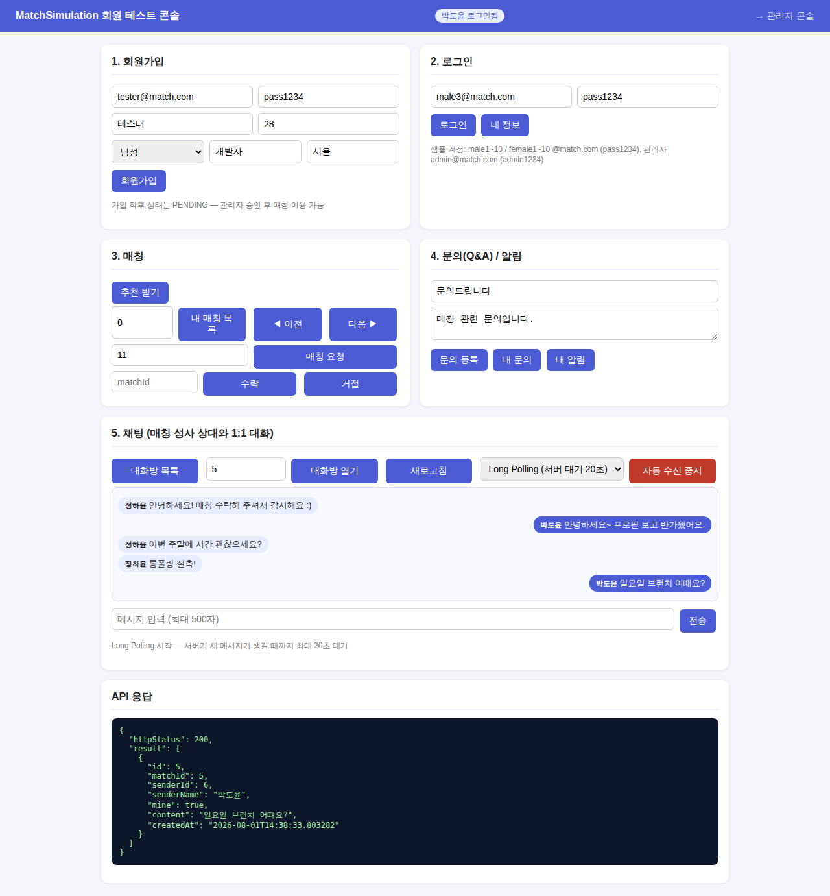

# Phase 5-3 완료 보고 문서 — 채팅 Long Polling (서버 대기 응답)

완료일: 2026-08-01
계획 문서: [phase5_3_longpolling_plan.md](phase5_3_longpolling_plan.md)

## 1. 결과 요약 — 계획 대비 전 항목 완료

| 항목 | 결과 |
| :--- | :--- |
| poll 엔드포인트 | ✅ `GET /api/chat/{matchId}/messages/poll?afterId=N&timeoutSeconds=20` (1~30초 보정) |
| DeferredResult | ✅ 타임아웃 시 빈 배열, 서블릿 스레드 비점유 (Virtual Threads 환경) |
| `ChatPollRegistry` | ✅ matchId별 대기자 큐 — 완료/타임아웃 콜백으로 자동 제거(누수 없음) |
| 알림 지점 | ✅ 컨트롤러에서 send 트랜잭션 **커밋 후** publish — 커밋 전 조회 유실 방지 |
| 경쟁 보정 | ✅ 조회→등록 사이 도착 메시지 재확인 (setResult는 중복 완료 무시) |
| 콘솔 | ✅ 수신 모드 선택(Short/Long) + 통합 토글, Long은 응답 즉시 재요청 루프 |
| 인증 수정 | ✅ `JwtAuthFilter.shouldNotFilterAsyncDispatch()=false` — ASYNC 디스패치 재인증 (미수정 시 비동기 응답 재개 때 401) |

## 2. 실측 결과 (2026-08-01 curl)

| 케이스 | 결과 |
| :--- | :--- |
| E1: poll 시점에 새 메시지 존재 | **0.02s** 즉시 응답 |
| E2: 대기 중 2초 뒤 상대 전송 | **2.04s에 응답** — 전송 후 지연 ≈ 0.04s |
| E3: 새 메시지 없음(timeoutSeconds=5) | 5.9s 후 200 + `[]` |
| E5: 비참여자 poll | 대기 없이 0.02s에 403 |

### Short Polling vs Long Polling (30초 동안 1건 수신 시나리오)

| 항목 | Short Polling (3초) | Long Polling (20초 대기) |
| :--- | :--- | :--- |
| 요청 수 | 10회 | **2회** (대기 1 + 재대기 1) |
| 빈 응답 | 9회 (90%) | 0~1회 |
| 전달 지연 | 최대 3초 (주기 의존) | **≈ 0초** (전송 즉시) |

## 3. QA 테스트 체크리스트

- [x] `ChatLongPollTest` 4건: 즉시 응답(E1), 대기 중 전송 → 즉시 완료 + 대기자 정리(E2/E7),
  비참여자 403(E5), 없는 매칭 404 — MockMvc async(asyncDispatch) 검증
- [x] 전체 **45건** 회귀 green (테스트 생성 데이터 정리 유지)
- [x] curl 실측: 위 표 (타임아웃/즉시/대기 3케이스 + 권한)

## 4. API 명세 변경

- `GET /api/chat/{matchId}/messages/poll?afterId=N&timeoutSeconds=20` 추가
  - 새 메시지 있으면 즉시, 없으면 최대 timeoutSeconds(1~30 보정) 대기 후 `[]`
  - 권한/상태 오류(403/404/400)는 대기 없이 즉시 응답
- 기존 조회/전송 API는 변경 없음 — Short Polling 방식도 계속 사용 가능

## 5. 채팅 단계별 진화 정리 (Phase 5 완결)

| 단계 | 방식 | 특징 | PR |
| :--- | :--- | :--- | :--- |
| 5-1 | 새로고침 + afterId 증분 | 메시지 모델·조회 계약 고정 | #12 |
| 5-2 | Short Polling (3초) | 자동화, 빈 응답 90% 실측 | #13 |
| 5-3 | Long Polling (서버 대기) | 요청 수 1/5, 지연 ≈ 0 | 본 단계 |
| 다음 | WebSocket | 양방향 실시간 (향후 과제) | - |

## 6. 동작 화면

