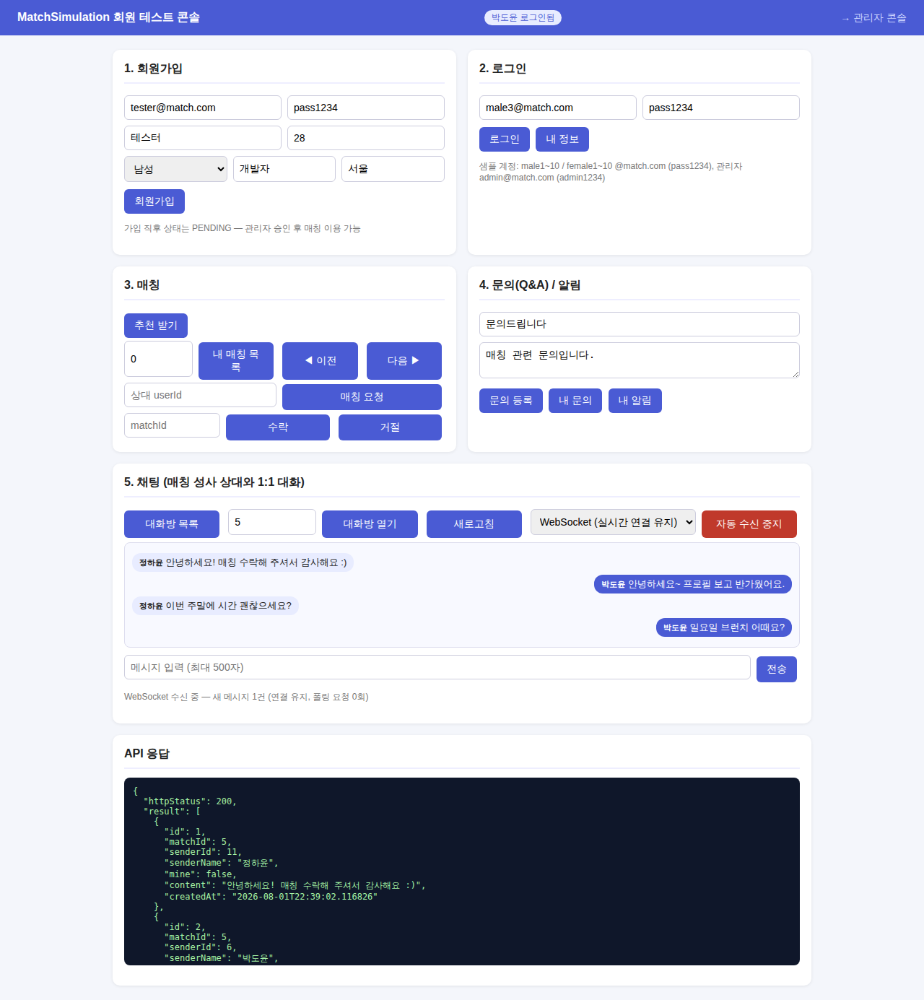

# Phase 6 완료 보고 문서 — 채팅 WebSocket (실시간 양방향)

완료일: 2026-08-02
계획 문서: [phase6_websocket_plan.md](phase6_websocket_plan.md)

## 1. 결과 요약 — 계획 대비 전 항목 완료

| 항목 | 결과 |
| :--- | :--- |
| 엔드포인트 | ✅ `ws://host/ws/chat?matchId={id}&token={JWT}` — 순수 WebSocket (STOMP 미사용) |
| 핸드셰이크 인증 | ✅ `ChatHandshakeInterceptor` — JWT 검증(기존 `JwtProvider` 재사용) + 정지 계정 차단 + ACCEPTED 참여자 검증(기존 `verifyParticipant` 재사용), 실패 시 연결 자체 거부 |
| 세션 레지스트리 | ✅ `ChatSessionRegistry` — matchId별 세션 보관, 종료/오류 시 자동 제거(누수 없음). Long Polling의 `ChatPollRegistry`와 대칭 구조 |
| 양방향 전송 | ✅ `{"content":"..."}` 프레임 → 기존 `ChatService.send` 재사용(권한·검증·저장 동일) 후 전체 세션 push |
| mine 구분 | ✅ 수신자 기준 — 세션별 userId로 다시 계산해 직렬화 |
| 수신 경로 교차 호환 | ✅ REST 전송 → WS push, WS 전송 → Long Polling 대기자 wake — 양측이 다른 수신 모드여도 실시간 유지 |
| 오류 처리 | ✅ 검증 실패는 `{"error":"..."}` 프레임 회신 후 연결 유지 |
| 콘솔 | ✅ 수신 모드에 **WebSocket** 추가 — WS 모드에서는 전송도 같은 연결로, 내 메시지는 push echo로 표시 |
| Security | ✅ `/ws/**` permitAll — HTTP 필터 대신 핸드셰이크 인터셉터가 인증 담당 (REST의 X-AUTH-TOKEN 방식은 변경 없음) |

## 2. 실측 결과 (2026-08-02, Node 22 내장 WebSocket)

| 케이스 | 결과 |
| :--- | :--- |
| E1: 핸드셰이크(연결 수립) | **13ms** — 이후 폴링 요청 0회 |
| E1: 상대 소켓 전송 → 내 수신 | push 지연 **9ms** |
| E2: 양방향 mine 구분 | 내 echo `mine=true`, 상대 수신 `mine=false` |
| E3: REST 전송 → WS push | **14ms** (교차 호환) |
| E4: 빈 내용 전송 | `{"error":"메시지 내용은 비어 있을 수 없습니다."}` 프레임, 연결 유지 |
| E5: 토큰 없음 / 비참여자 | 핸드셰이크 **11ms/10ms에 거부** (연결 수립 자체 차단) |

### 채팅 수신 방식 4단계 최종 비교 (30초 동안 1건 수신 시나리오)

| 항목 | 새로고침 | Short Polling (3초) | Long Polling (20초 대기) | **WebSocket** |
| :--- | :--- | :--- | :--- | :--- |
| HTTP 요청 수 | 수동 (사용자 조작) | 10회 | 2회 | **0회** (핸드셰이크 1회 후 연결 유지) |
| 빈 응답 | - | 9회 (90%) | 0~1회 | **없음** |
| 전달 지연 | 사용자 조작까지 | 최대 3초 | ≈ 0.04s (재요청 공백 존재) | **≈ 0.009s** (공백 없음) |
| 전송 채널 | POST | POST | POST | **같은 연결 (양방향)** |

## 3. QA 테스트 체크리스트

- [x] `ChatWebSocketTest` 6건 — RANDOM_PORT 실연결(`StandardWebSocketClient`):
  양방향 전송+mine 구분, REST→WS 교차 push, 토큰 없음/위조 거부, 비참여자 거부,
  종료 시 세션 정리(누수 없음), 검증 실패 error 프레임 후 연결 유지
- [x] 전체 **51건** 회귀 green (테스트 생성 데이터 정리 유지)
- [x] Node 실측: 위 표 6케이스
- [x] 콘솔 실동작: WebSocket 모드 연결 → 소켓 전송 → push echo 수신 (아래 화면)

## 4. API 명세 변경

- WebSocket `ws://host/ws/chat?matchId={id}&token={JWT}` 추가
  - 수신: 새 메시지가 저장되면 `ChatMessageResponse` JSON 프레임을 즉시 push
  - 전송: `{"content":"..."}` 프레임 (1~500자) — REST POST와 동일한 검증·권한
  - 오류: 검증/권한 실패는 `{"error":"..."}` 프레임 (연결 유지), 인증 실패는 핸드셰이크 거부
- 기존 REST API(rooms/send/messages/poll)는 변경 없음 — 4가지 수신 방식 공존

## 5. 구현 노트

- **STOMP를 쓰지 않은 이유**: 구독 대상이 matchId 하나뿐이라 브로커 계층이 과하고,
  콘솔이 vanilla JS(브라우저 내장 WebSocket)라 외부 클라이언트 라이브러리 없이 동작.
  핸드셰이크 인터셉터·세션 레지스트리·브로드캐스트를 직접 구현해 저수준 동작을 드러냄
- **JWT를 쿼리 파라미터로 받는 이유**: 브라우저 WebSocket API는 커스텀 헤더를 실을 수 없음.
  검증은 연결 수립 전(HandshakeInterceptor)에 끝나 미인증 연결이 세션을 점유하지 않음
- **push 시점**: `ChatService.send`의 트랜잭션 커밋 후(핸들러/컨트롤러에서) broadcast —
  Long Polling에서 확인한 "커밋 전 조회 유실" 문제를 동일하게 회피

## 6. 동작 화면

