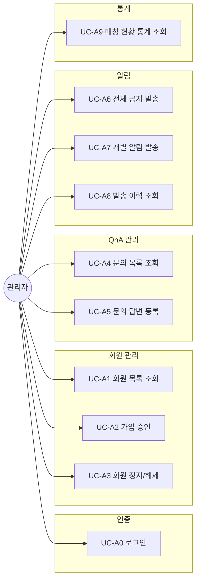
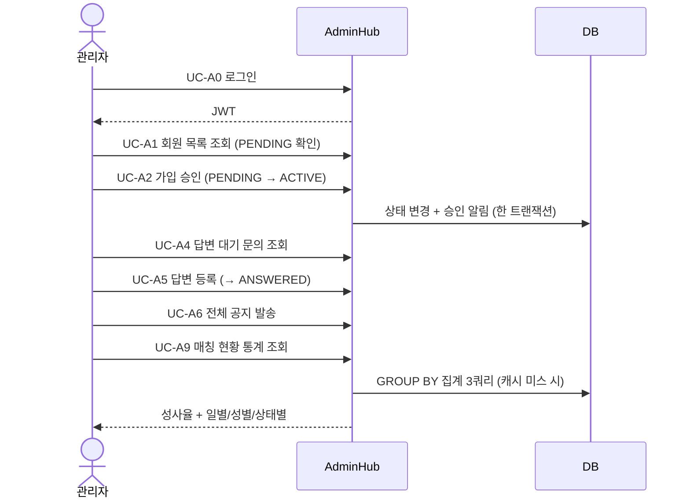

# 유즈케이스 문서 (Use Cases)

액터는 **관리자(Admin)** 단일이며, 일반 회원은 관리 대상 데이터로만 등장한다.
기능/API 상세: [admin_mode.md](admin_mode.md)

---

## 1. 관리자 유즈케이스

| ID | 유즈케이스 | 사전 조건 | 기본 흐름 | 예외/대안 |
| :--- | :--- | :--- | :--- | :--- |
| UC-A0 | 로그인 | 관리자 계정 존재 | 이메일+비밀번호 → JWT 발급 | 비밀번호 불일치 401, `SUSPENDED` 403 |
| UC-A1 | 회원 목록 조회 | 관리자 로그인 | 전체 회원(상태 포함) 페이징 조회 | Role≠ADMIN 403, 잘못된 정렬 필드 400, size>100은 100으로 클램프 |
| UC-A2 | 가입 승인 | 대상이 `PENDING` | 상태 변경 → `ACTIVE` + 대상 회원에게 승인 알림 | 대상 없음 404, 알림 저장 실패 시 상태 변경도 롤백 |
| UC-A3 | 회원 정지/해제 | 관리자 로그인 | `SUSPENDED`(로그인·토큰 차단) ↔ `ACTIVE` + 대상 회원 알림 | 대상 없음 404, 같은 상태로 변경 시 알림 미생성 |
| UC-A4 | 문의 목록 조회 | 관리자 로그인 | 전체 또는 `WAITING`/`ANSWERED` 필터 페이징 조회 | — |
| UC-A5 | 문의 답변 등록 | 문의 존재 | 답변 저장 → `ANSWERED` + 답변 시각 기록 | 문의 없음 404, 답변 공백 400 |
| UC-A6 | 전체 공지 발송 | 관리자 로그인 | 대상 미지정(`targetUserId=null`) 알림 생성 | 제목/내용 누락 400 |
| UC-A7 | 개별 알림 발송 | 대상 회원 존재 | 특정 userId 대상 알림 생성 | 대상 없음 404 |
| UC-A8 | 발송 이력 조회 | 관리자 로그인 | 등록된 알림 최신순 조회 | — |
| UC-A9 | 매칭 현황 통계 조회 | 관리자 로그인 | 총/성사 건수, 성사율, 일별·성별·상태별 집계 | 60초 캐시 적중 시 DB 미조회 |

## 2. 시스템 유즈케이스 (배치)

| ID | 유즈케이스 | 트리거 | 흐름 |
| :--- | :--- | :--- | :--- |
| UC-S1 | 무응답 매칭 자동 만료 | 기동 1분 후 + 1시간 주기 | 7일 경과 `REQUESTED` → `EXPIRED` 전이 + 요청자 알림 + 통계 캐시 무효화 |

## 3. 대표 시나리오 — 가입 승인부터 통계 확인까지

## 4. 관리자 전용 전환으로 제외된 유즈케이스

아래 사용자 모드 유즈케이스는 관리자 전용 전환과 함께 제거되었다.
관리 대상 데이터(회원·문의·매칭 기록)는 남아 있으므로, 향후 외부 시스템에서의
데이터 인입 경로로 재정의될 수 있다.

| 제거된 유즈케이스 | 대체 방향 |
| :--- | :--- |
| 추천 상대 조회 / 매칭 요청 / 수락·거절 | 외부 시스템의 매칭 이벤트 수집으로 재정의 |
| 1:1 채팅 (Polling / WebSocket) | 제거 |
| 사용자 문의 등록 / 내 문의 조회 | 외부·게스트 티켓 인입 API로 재정의 |
| 내 알림 조회 | 관리자 발송 이력(UC-A8)만 유지 |
