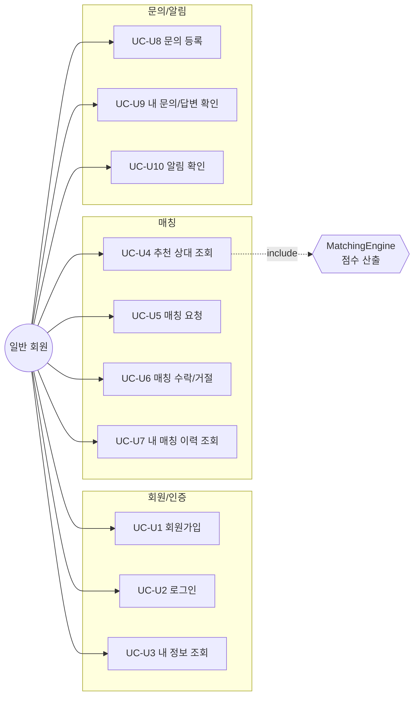
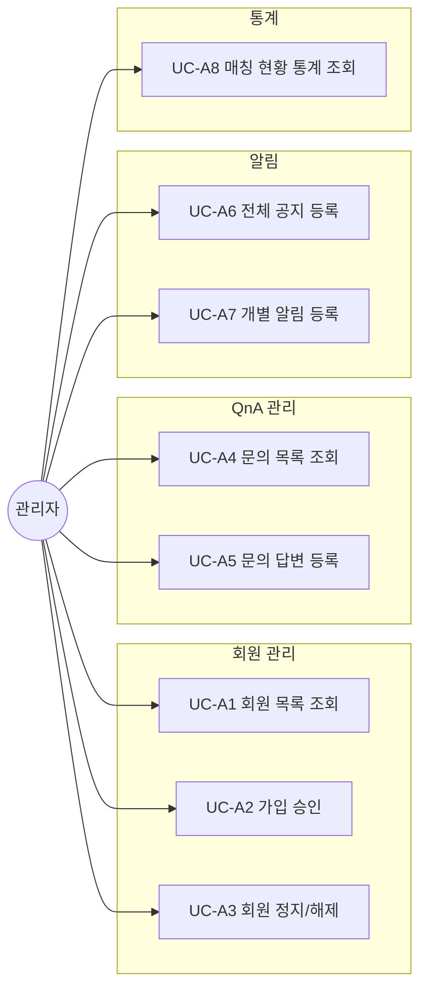
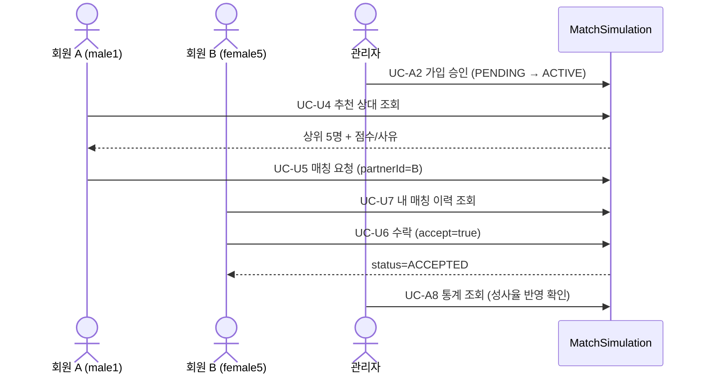

# 유즈케이스 문서 (Use Cases)

액터는 **일반 회원(User)** 과 **관리자(Admin)** 로 나뉜다.
기능/API 상세: [user_mode.md](user_mode.md) · [admin_mode.md](admin_mode.md)

---

## 1. 사용자 모드 유즈케이스

| ID | 유즈케이스 | 사전 조건 | 기본 흐름 | 예외/대안 |
| :--- | :--- | :--- | :--- | :--- |
| UC-U1 | 회원가입 | 없음 | 인적사항 입력 → 가입 → `PENDING` 상태 | 이메일 중복 400, 나이 범위(19~100) 위반 400 |
| UC-U2 | 로그인 | 계정 존재 | 이메일+비밀번호 → UUID 토큰 발급 | 비밀번호 불일치 401, `SUSPENDED` 403 |
| UC-U3 | 내 정보 조회 | 로그인 | 토큰으로 본인 정보 조회 | 유효하지 않은 토큰 401 |
| UC-U4 | 추천 상대 조회 | 로그인 + `ACTIVE` | MatchingEngine이 이성·ACTIVE 후보 점수화 → 상위 5명 + 사유 | `PENDING`/비활성 회원 403 |
| UC-U5 | 매칭 요청 | 로그인 + `ACTIVE` | 상대 지정 → `REQUESTED` 생성 | 자기 자신/비활성 상대/중복 요청 400, 상대 없음 404 |
| UC-U6 | 매칭 수락/거절 | 요청 받은 본인 | 수락 → `ACCEPTED` / 거절 → `REJECTED` | 요청 받은 본인 아님 403, 이미 처리됨 400 |
| UC-U7 | 내 매칭 이력 조회 | 로그인 | 보낸/받은 매칭 전체 조회 | — |
| UC-U8 | 문의 등록 | 로그인 | 제목+내용 등록 → `WAITING` | — |
| UC-U9 | 내 문의/답변 확인 | 로그인 | 내 문의 목록에서 관리자 답변(`ANSWERED`) 확인 | — |
| UC-U10 | 알림 확인 | 로그인 | 전체 공지 + 본인 대상 알림 최신순 조회 | — |

## 2. 관리자 모드 유즈케이스

| ID | 유즈케이스 | 사전 조건 | 기본 흐름 | 예외/대안 |
| :--- | :--- | :--- | :--- | :--- |
| UC-A1 | 회원 목록 조회 | 관리자 로그인 | 전체 회원(상태 포함) 조회 | Role≠ADMIN 403 |
| UC-A2 | 가입 승인 | 대상이 `PENDING` | 상태 변경 → `ACTIVE` (매칭 이용 가능) | 대상 없음 404 |
| UC-A3 | 회원 정지/해제 | 관리자 로그인 | `SUSPENDED`(로그인 차단) ↔ `ACTIVE` | 대상 없음 404 |
| UC-A4 | 문의 목록 조회 | 관리자 로그인 | 전체 또는 `WAITING`/`ANSWERED` 필터 조회 | — |
| UC-A5 | 문의 답변 등록 | 문의 존재 | 답변 저장 → `ANSWERED` + 답변 시각 기록 | 문의 없음 404 |
| UC-A6 | 전체 공지 등록 | 관리자 로그인 | 대상 미지정 알림 → 전 회원 노출 | 제목/내용 누락 400 |
| UC-A7 | 개별 알림 등록 | 대상 회원 존재 | 특정 userId 대상 알림 생성 | 대상 없음 404 |
| UC-A8 | 매칭 현황 통계 조회 | 관리자 로그인 | 총/성사 건수, 성사율, 일별·성별·상태별 집계 | — |

## 3. 대표 시나리오 — 교차 흐름 (매칭 성사)

