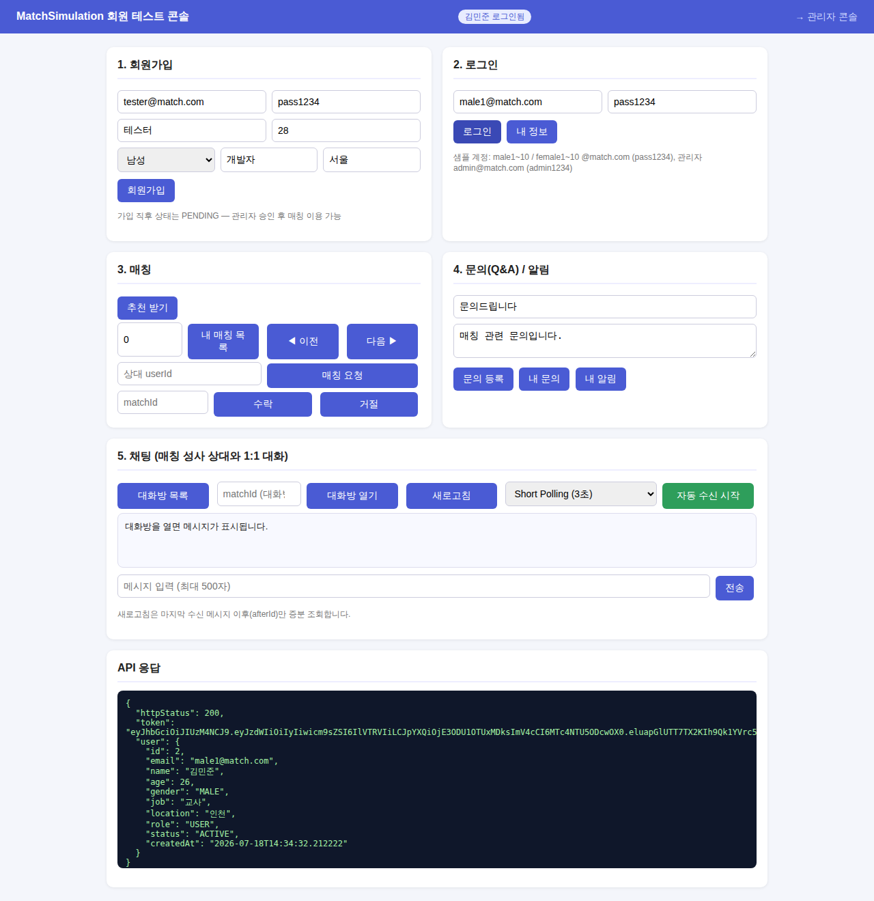
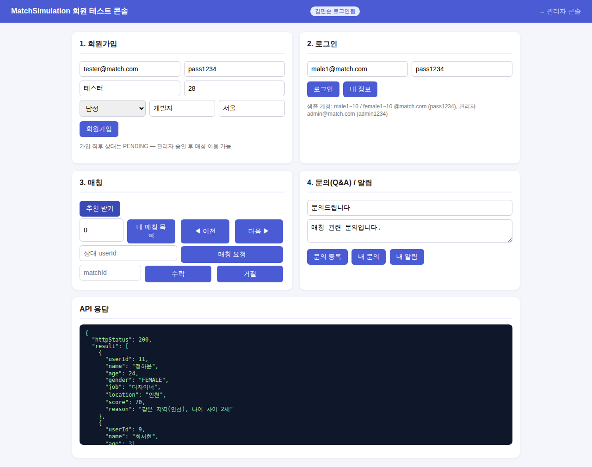
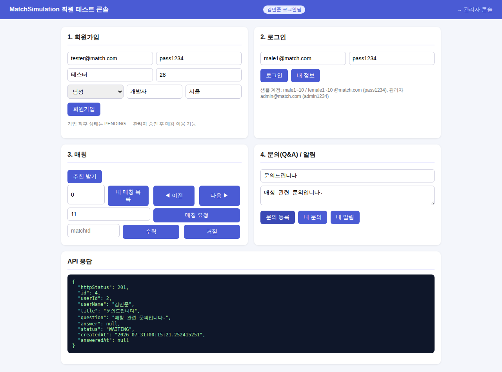

# 사용자 모드 문서 (User Mode)

대상: 일반 회원 기능 — 회원가입/로그인, 매칭, 문의, 알림
콘솔: `http://localhost:8080/index.html`
관리자 모드 문서: [admin_mode.md](admin_mode.md)

---

## 1. 기능 명세

### 1.1 회원가입
- 이메일/비밀번호/이름/나이/성별/직군/지역 입력으로 가입
- 이메일 중복 시 400 에러, 나이는 19~100세 검증
- 가입 직후 상태는 `PENDING` — **관리자 승인 후 매칭 이용 가능**

### 1.2 로그인 (In-Memory 더미 인증)
- 이메일 + 비밀번호 일치 시 UUID 토큰 발급
- 이후 모든 인증 API는 `X-AUTH-TOKEN` 헤더로 호출
- `SUSPENDED` 계정은 로그인 차단(403), 비밀번호 불일치 401

### 1.3 매칭
- **추천**: `ACTIVE` 상태의 이성 회원을 후보로 `MatchingEngine`이 점수화, 상위 5명 반환
  - 기본 엔진(local): 지역 일치 +40, 나이 차이(1세당 -5, 최대 +40), 직군 일치 +20
  - 각 추천에는 점수 산출 근거(reason) 포함
- **매칭 요청**: 상대 지정 요청 생성(`REQUESTED`). 자기 자신/비활성 회원/중복 요청 차단
- **매칭 응답**: 요청을 **받은 상대만** 수락(`ACCEPTED`)/거절(`REJECTED`) 가능
- **내 매칭 조회**: 내가 보낸/받은 전체 매칭 이력

### 1.4 Q&A (1:1 문의)
- 문의 등록(제목 + 내용, 초기 상태 `WAITING`)
- 내 문의 목록에서 관리자 답변 확인(`ANSWERED`)

### 1.5 알림
- 전체 공지(targetUserId=null) + 본인 대상 알림을 합쳐 최신순 조회

## 2. API 명세

Base URL: `http://localhost:8080` · 🔒 = `X-AUTH-TOKEN` 헤더 필요
에러 응답(공통): `{"status": 400|401|403|404, "message": "..."}`

### POST /api/auth/signup — 회원가입
```json
// Request
{"email":"new@match.com","password":"p1","name":"신규","age":27,
 "gender":"FEMALE","job":"개발자","location":"서울"}
// Response 201
{"id":22,"email":"new@match.com","name":"신규","age":27,"gender":"FEMALE",
 "job":"개발자","location":"서울","role":"USER","status":"PENDING","createdAt":"..."}
```

### POST /api/auth/login — 로그인
```json
// Request
{"email":"male1@match.com","password":"pass1234"}
// Response 200
{"token":"550e8400-...","user":{ ...UserResponse }}
```
- 401: 이메일/비밀번호 불일치 · 403: 정지 계정

### GET /api/auth/me — 내 정보 🔒
Response 200: `UserResponse`

### GET /api/matching/recommendations — 추천 목록 🔒
- ACTIVE 회원만 호출 가능(아니면 403). 상위 5명 반환.
```json
[{"userId":11,"name":"정하윤","age":24,"gender":"FEMALE","job":"디자이너",
  "location":"인천","score":70.0,"reason":"같은 지역(인천), 나이 차이 2세"}]
```

### POST /api/matching/requests — 매칭 요청 🔒
```json
// Request
{"partnerId":22}
// Response 201
{"id":31,"requesterId":2,"requesterName":"김민준","partnerId":22,
 "partnerName":"신규","status":"REQUESTED","score":35.0,"createdAt":"..."}
```
- 400: 자기 자신/비활성 상대/중복 요청 · 404: 상대 없음

### POST /api/matching/requests/{matchId}/respond — 수락/거절 🔒
```json
// Request
{"accept":true}
// Response 200 — status가 ACCEPTED 또는 REJECTED로 변경된 MatchResponse
```
- 403: 요청 받은 본인이 아님 · 400: 이미 처리됨 · **409: 동시 응답 경쟁에서 밀림(낙관적 락)**
- 수락 성공 시 요청자/수락자 양측에 알림이 생성된다 (상태 변경과 같은 트랜잭션 — 실패 시 함께 롤백)

### GET /api/matching/my — 내 매칭 목록 🔒 (페이징)
- 파라미터: `?page=0&size=10&sort=createdAt,desc` (size 최대 100, 기본 최신순)
```json
// Response 200
{"content":[{ ...MatchResponse }],
 "page":0,"size":10,"totalElements":3,"totalPages":1,"hasNext":false}
```
- 400: 존재하지 않는 sort 필드

### POST /api/qna — 문의 등록 🔒
```json
// Request
{"title":"문의드립니다","question":"매칭 관련 문의입니다."}
// Response 201
{"id":4,"userId":2,"userName":"김민준","title":"...","question":"...",
 "answer":null,"status":"WAITING","createdAt":"...","answeredAt":null}
```

### GET /api/qna/my — 내 문의 목록 🔒
Response 200: `QnaResponse[]` (최신순)

### GET /api/notifications/my — 내 알림 🔒
Response 200: 전체 공지 + 본인 대상 알림 (최신순)
```json
[{"id":3,"targetUserId":null,"target":"ALL","title":"공지","message":"...","createdAt":"..."}]
```

## 3. 콘솔 사용 시나리오 (`/index.html`)

1. `male1@match.com` / `pass1234`로 **로그인** (상단 배지에 이름 표시)
2. **추천 받기** → 추천 목록의 userId 확인
3. userId 입력 후 **매칭 요청**
4. 상대 계정(예: `female1@match.com`)으로 로그인 → **내 매칭 목록**에서 matchId 확인 → **수락/거절**
5. **문의 등록** 후 **내 문의**로 답변 확인, **내 알림**으로 공지 확인

## 4. 샘플 계정

| 이메일 | 비밀번호 | 상태 |
| :--- | :--- | :--- |
| male1~10@match.com / female1~10@match.com | pass1234 | 1~8번 ACTIVE, 9번 PENDING, 10번 SUSPENDED |

## 5. 동작 화면

| 화면 | 설명 |
| :--- | :--- |
|  | 로그인 성공 — 상단 배지에 로그인 사용자 표시 |
|  | 추천 받기 — 점수·추천 사유 포함 응답 |
|  | 매칭 요청 — REQUESTED 생성 |
|  | 문의 등록 — WAITING 상태 |
